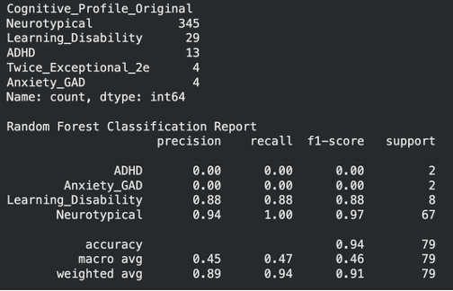
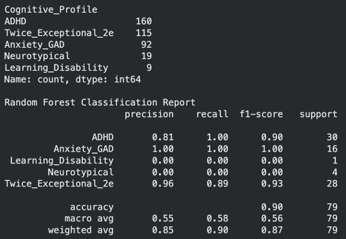
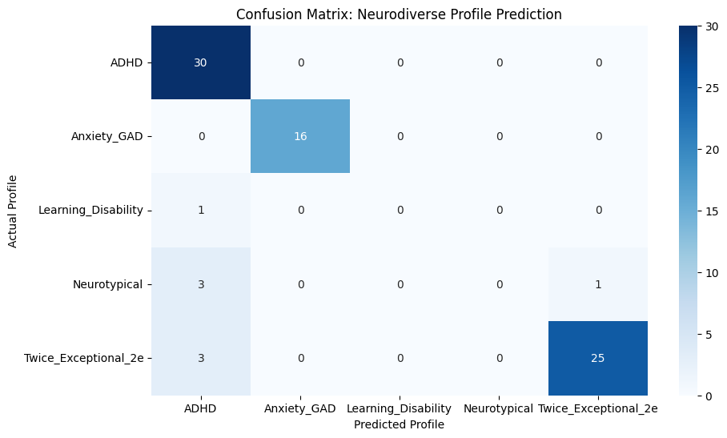
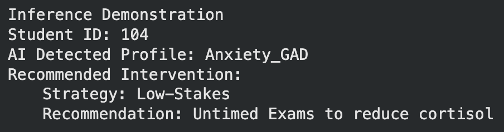

# Detecting Neurocognitive Profiles using Classification

**4AI3 Project Final Report**
Kushika Senera
Bachelor of Technology – Software Engineering Technology
McMaster University

---

## Quick Summary

* Built a multi-class classifier to detect neurocognitive learning profiles
* Used behavioural metadata instead of grade prediction
* Engineered ADHD, GAD, and Twice-Exceptional labels
* Random Forest with balanced class weights
* Achieved **90% accuracy** with strong minority recall
* Goal: early learning-needs triage for education systems

---

## Abstract

Educational prediction models typically focus on regression tasks aimed at forecasting final grades. This approach overlooks behavioural factors associated with academic performance, such as high-functioning learning disabilities and related cognitive burdens. This work pivots from regression to multi-class classification, using behavioural and demographic metadata from the UCI Student Performance Dataset to infer neurodiverse profiles. Feature engineering introduced synthetic labels approximating common neurodiversity markers. A Random Forest model with balanced class weights achieved 90% accuracy with high recall for at-risk neurodiverse groups. Behavioural features provide sufficient data to infer hidden cognitive profiles to support unmet learning needs.

**Keywords:** Classification Learning Task, Random Forest, Feature Engineering, Neurodiversity, Educational Triage

---

## I. Introduction

Educational analytics using machine learning traditionally focus on predicting academic outcomes as a highly performance-centric approach. These pipelines forecast final grades using behavioural and demographic features but fail to capture underlying cognitive conditions. Students with high academic output may still experience executive dysfunction, anxiety, or hidden learning burdens.

This project pivots from regression to classification using behavioural metadata such as absences, social activity, health ratings, and study time to classify students into neurocognitive support profiles. The objective is early triage for identifying anxiety patterns, executive dysfunction, and cognitive burden.

---

## II. Methodology

### Dataset

The UCI Student Performance Dataset (395 samples) with thirty demographic and behavioural features was used. Grade attributes were excluded to prevent performance leakage into cognitive profile prediction.

### Feature Engineering

Synthetic cognitive profiles were defined:

* ADHD markers: `goout > 3` or `absences > 1`
* Generalized Anxiety (GAD): `studytime > 1`
* Twice Exceptional (2e): `G3 > 11`
* Learning Disability (ASD proxy): `failures > 0`
* Neurotypical: none of the above

### Preliminary Distribution



### Class Imbalance Correction

Initial strict rules produced 87% neurotypical samples. Balanced class weights were applied and rules expanded to improve minority representation. This reduced overall accuracy but improved detection of at-risk profiles.

### Preprocessing

* One-hot encoding for categorical features
* Z-score normalization using StandardScaler
* 80/20 train-test split

---

## III. Model Evaluation

### Model Selection

Random Forest was selected to capture nonlinear behavioural interactions. Deep learning models were rejected due to small dataset size (N=395).

### Optimization Strategy

Balanced class weights were applied to force the model to learn minority decision boundaries and improve recall for neurodiverse profiles.

---

## IV. Results and Discussion

### Classification Performance

The balanced Random Forest classifier achieved **90% overall accuracy** with strong recall for minority groups.



### Confusion Matrix

The model prioritizes sensitivity to at-risk neurodiverse profiles. Some neurotypical students were flagged as ADHD, representing intentional cost-sensitive learning tradeoffs.



### Inference Demonstration

A single-sample inference simulation validated the model's ability to translate behavioural data into actionable support recommendations.



---

## V. Conclusion

This work demonstrates that behavioural metadata can be used to infer neurocognitive support profiles. Pivoting from regression to classification enables proactive identification of students whose learning needs diverge from traditional performance metrics. The approach supports scalable AI-driven educational triage systems.

---

## Notebook

Open in Google Colab:
https://colab.research.google.com/github/ksenera/neurocognitive-profile-classifier/blob/main/4AI3_Project.ipynb

---

## Repository Structure

```
neurocognitive-profile-classifier/
 ├── README.md
 ├── 4AI3_Project.ipynb
 ├── requirements.txt
 └── images/
     ├── Preliminary_Clinical_Profiles_Report.png
     ├── Balanced_Profiles_Random_Forest_Report.png
     ├── Confusion_Matrix.png
     └── Single_Sample_Inference.png
```

---

## Requirements

```
pandas
numpy
matplotlib
seaborn
scikit-learn
```

---

## Future Work

* Use real clinical-labelled datasets
* Add explainability (SHAP values)
* Deploy as educational decision-support tool
* Expand dataset size for robustness

---
